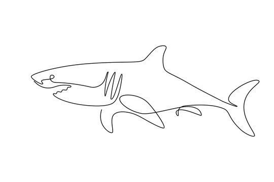

# Shark-Human Interactions in the MENA Region: Data Analysis Project

## Overview

Welcome to the data analysis project focused on understanding the interactions between sharks and humans, particularly in the Middle East and North African (MENA) region. This project utilizes the data from the Global Shark Attack File (GSAF), maintained by the Shark Research Institute (SRI), to uncover patterns, trends, and insights regarding shark-human dynamics.

## Key Findings

### Temporal Analysis

- Fluctuations in attack frequency over time, with a notable resurgence in recent years.
- Insights into seasonal variations and their impact on incident rates.

### Geographic Distribution

- Egypt emerged as the epicenter of shark attacks in the MENA region, followed by Iran, Israel, Iraq, and the UAE.
- The Red Sea region stood out as the hotspot for incidents, particularly during peak tourist months.

### Victim Activities

- Snorkeling, swimming, and diving identified as prominent triggers for shark attacks.
- Understanding human behaviors in aquatic environments for better risk assessment.

### Species Involvement

- Variation in fatality rates among different shark species.
- Insights into the nuanced nature of interactions and species-specific behaviors.

### Nature of Attacks

- Overwhelming majority of attacks classified as unprovoked, dispelling myths of inherent aggression.
- Factors such as curiosity and misidentification highlighted as primary triggers.

## Conservation Efforts

Despite the relatively low number of shark attacks worldwide, the illegal mass fishing of sharks for their fins continues to persist. This indiscriminate killing disrupts the delicate balance of ecosystems, with detrimental consequences on marine biodiversity and ecosystem health.

- Sharks play a crucial role in maintaining the balance of marine ecosystems by controlling the populations of other species.
- Over 100 million sharks are killed annually due to commercial fishing practices, leading to potential population declines and ecological repercussions.

## Conclusion

This data analysis project provides valuable insights into shark-human interactions in the MENA region, emphasizing the importance of understanding and coexisting with these apex predators. By leveraging data manipulation, visualization, and analysis techniques, we aim to contribute to the ongoing dialogue on marine conservation and sustainable management of shark populations.

For access to the incident log data and further analysis, please visit the [Global Shark Attack File website](https://www.sharkattackfile.net/incidentlog.htm).
